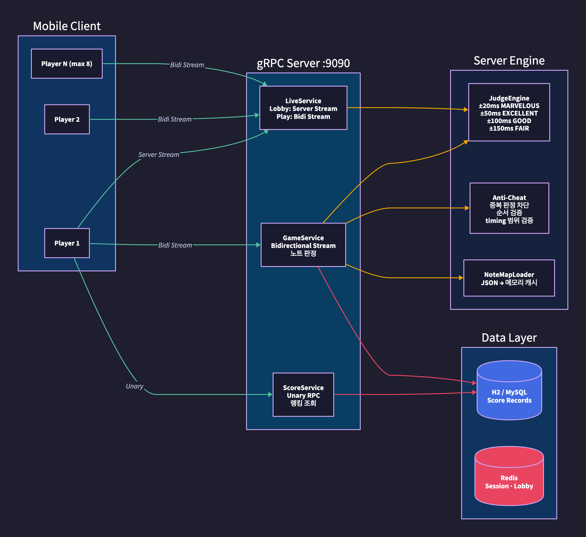
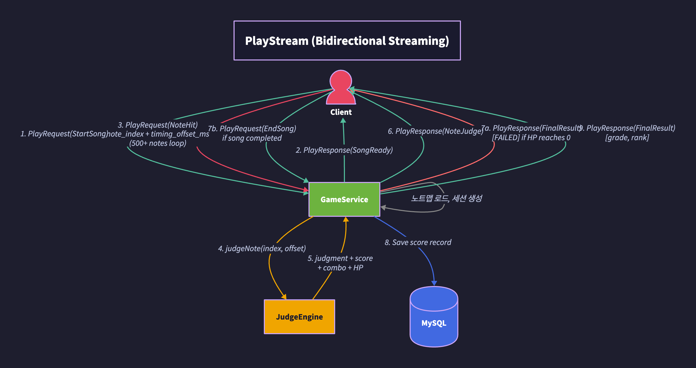
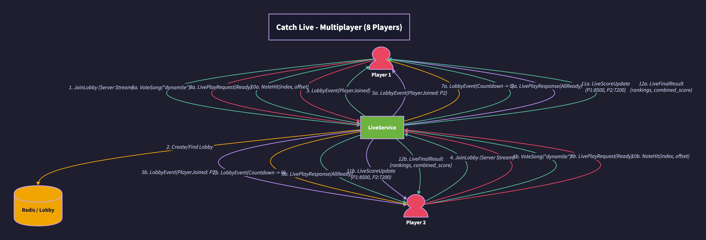

# gRPC Rhythm Game Server


리듬 게임의 **gRPC 기반 백엔드 서버**입니다.
HTTP/2 양방향 스트리밍으로 실시간 노트 판정, 멀티플레이 동기화, 서버 권위 안티치트를 구현합니다.

## Why gRPC?

리듬 게임에서 REST 대신 gRPC를 사용하는 이유:

| 문제 | REST | gRPC |
|------|------|------|
| 곡 하나에 500+ 노트 판정 | 매 노트마다 HTTP 요청 → 오버헤드 | **양방향 스트리밍** → 하나의 연결에서 지속 통신 |
| 8인 멀티플레이 점수 동기화 | WebSocket 별도 필요 | **Server-stream**으로 실시간 브로드캐스트 |
| 모바일 네트워크 효율 | JSON 파싱 오버헤드 | **Protobuf** 바이너리 → 70% 더 작은 페이로드 |
| 매치메이킹 로비 상태 | 폴링 필요 | **Server-stream**으로 이벤트 push |
| 타입 안전성 | API 문서 의존 | **.proto 스키마**에서 코드 자동 생성 |

## Architecture



## Core: PlayStream (Bidirectional Streaming)

곡 플레이의 전체 라이프사이클을 **하나의 gRPC 스트림**에서 처리합니다.



**서버 판정이 핵심** — 클라이언트가 "MARVELOUS 500개"라고 보내면 조작 가능.
대신 `timing_offset_ms`만 전송하면 서버가 노트맵과 대조하여 판정합니다.

## Server-Authoritative Anti-Cheat

```java
// GameSession.java — 안티치트 검증 로직

public JudgeResult judgeNote(int noteIndex, long timingOffsetMs) {
    // 1. 범위 검증 — 존재하지 않는 노트 차단
    if (noteIndex < 0 || noteIndex >= noteMap.notes().size()) return null;

    // 2. 중복 판정 차단 — 같은 노트를 두 번 보내는 치트 방지
    if (judgedNotes.get(noteIndex)) return null;

    // 3. 순서 검증 — 극단적 역순 입력 차단 (±3 허용: 네트워크 지연 고려)
    if (noteIndex < lastJudgedIndex - 3) return null;

    // 4. 서버가 판정 수행 (클라이언트의 판정 결과를 믿지 않음)
    Judgment judgment = calculateJudgment(Math.abs(timingOffsetMs));
    // ...
}
```

| 치트 시도 | 서버 대응 |
|----------|----------|
| 같은 노트 2회 전송 | `BitSet`으로 중복 차단 |
| 없는 노트 인덱스 전송 | 범위 검증 후 무시 |
| 역순 노트 전송 (미래 노트 조작) | ±3 범위 외 차단 |
| 클라이언트에서 MARVELOUS 조작 | 서버가 timing_offset_ms로 직접 판정 |

## Multiplayer: Catch Live (8 Players)



## gRPC Service 구조

| Service | RPC Type | Method | 용도 |
|---------|----------|--------|------|
| **GameService** | **Bidi Stream** | `PlayStream` | 실시간 노트 판정 (핵심) |
| | Unary | `GetSongList` | 곡 목록 |
| | Unary | `GetSongDetail` | 곡 상세 (노트 수, BPM) |
| **LiveService** | **Server Stream** | `JoinLobby` | 로비 이벤트 수신 |
| | Unary | `VoteSong` | 곡 투표 |
| | **Bidi Stream** | `StartLive` | 멀티플레이 동시 플레이 |
| | Unary | `LeaveLobby` | 로비 퇴장 |
| **ScoreService** | Unary | `GetRanking` | 곡별 랭킹 조회 |
| | Unary | `GetMyBestScores` | 개인 최고 기록 |

## Scoring System

```
판정 윈도우:
  ±20ms  → MARVELOUS (1000점)
  ±50ms  → EXCELLENT (800점)
  ±100ms → GOOD      (500점)
  ±150ms → FAIR      (200점, HP -5%)
  >150ms → MISS      (0점,   HP -10%)

콤보 배율:
  10콤보마다 5% 증가, 최대 50%
  GOOD = 콤보 유지 (증가 없음)
  FAIR/MISS = 콤보 리셋

카드 보너스:
  장착 카드의 멤버 파트와 현재 노트의 파트가 일치하면 20% 추가

등급 계산:
  SSS (98%+) → SS (95%+) → S (90%+) → A (80%+) → B (70%+) → C (60%+) → F
```

## Project Structure

```
src/main/
├── proto/
│   ├── game_service.proto      # PlayStream 양방향 스트리밍 정의
│   ├── live_service.proto      # 멀티플레이 서비스 정의
│   └── score_service.proto     # 랭킹 서비스 정의
├── java/com/rhythmgame/
│   ├── game/
│   │   ├── service/            # GameGrpcService (PlayStream 구현체)
│   │   ├── domain/             # GameSession (판정 엔진 + 안티치트)
│   │   └── engine/             # NoteMapLoader (노트맵 캐시)
│   ├── live/
│   │   ├── service/            # LiveGrpcService (로비 + 멀티플레이)
│   │   └── domain/             # Lobby (8인 로비 상태 관리)
│   ├── score/
│   │   ├── service/            # ScoreGrpcService, ScoreRecordService
│   │   ├── domain/             # ScoreRecord (JPA Entity)
│   │   └── repository/         # ScoreRecordRepository
│   └── config/                 # 설정
└── resources/
    ├── notemaps/                # 곡별 노트맵 JSON
    └── application.yml
```

## Quick Start

```bash
# Build (Protobuf 코드 자동 생성 포함)
./gradlew build

# Run
./gradlew bootRun

# gRPC 서버: localhost:9090
# H2 Console: localhost:8080/h2-console
```

### grpcurl 테스트

```bash
# 곡 목록 조회 (Unary)
grpcurl -plaintext localhost:9090 rhythmgame.GameService/GetSongList

# 곡 상세 조회
grpcurl -plaintext -d '{"song_id": "dynamite"}' \
  localhost:9090 rhythmgame.GameService/GetSongDetail

# 랭킹 조회
grpcurl -plaintext -d '{"song_id": "dynamite", "difficulty": "NORMAL", "top_n": 10}' \
  localhost:9090 rhythmgame.ScoreService/GetRanking
```

## Tech Stack

| Category | Technology |
|----------|-----------|
| **Language** | Java 17 |
| **Framework** | Spring Boot 3.3.4 |
| **RPC** | gRPC 1.68 (Netty), Protocol Buffers 4.28 |
| **Streaming** | HTTP/2 Bidirectional Streaming |
| **Database** | H2 (dev) / MySQL 8.0 (prod) |
| **ORM** | Spring Data JPA |
| **Build** | Gradle 8.10 + protobuf-gradle-plugin |

## License

This project is for portfolio purposes.
